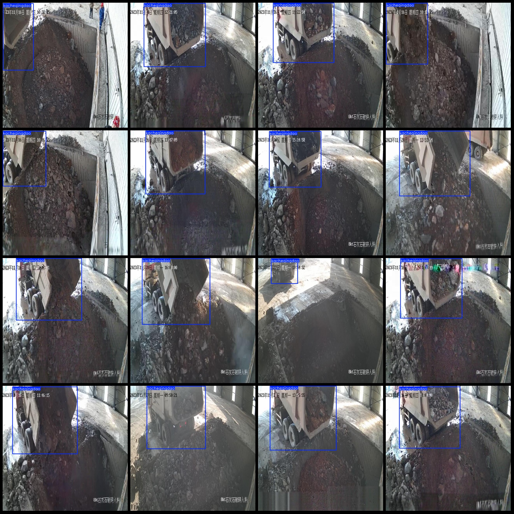
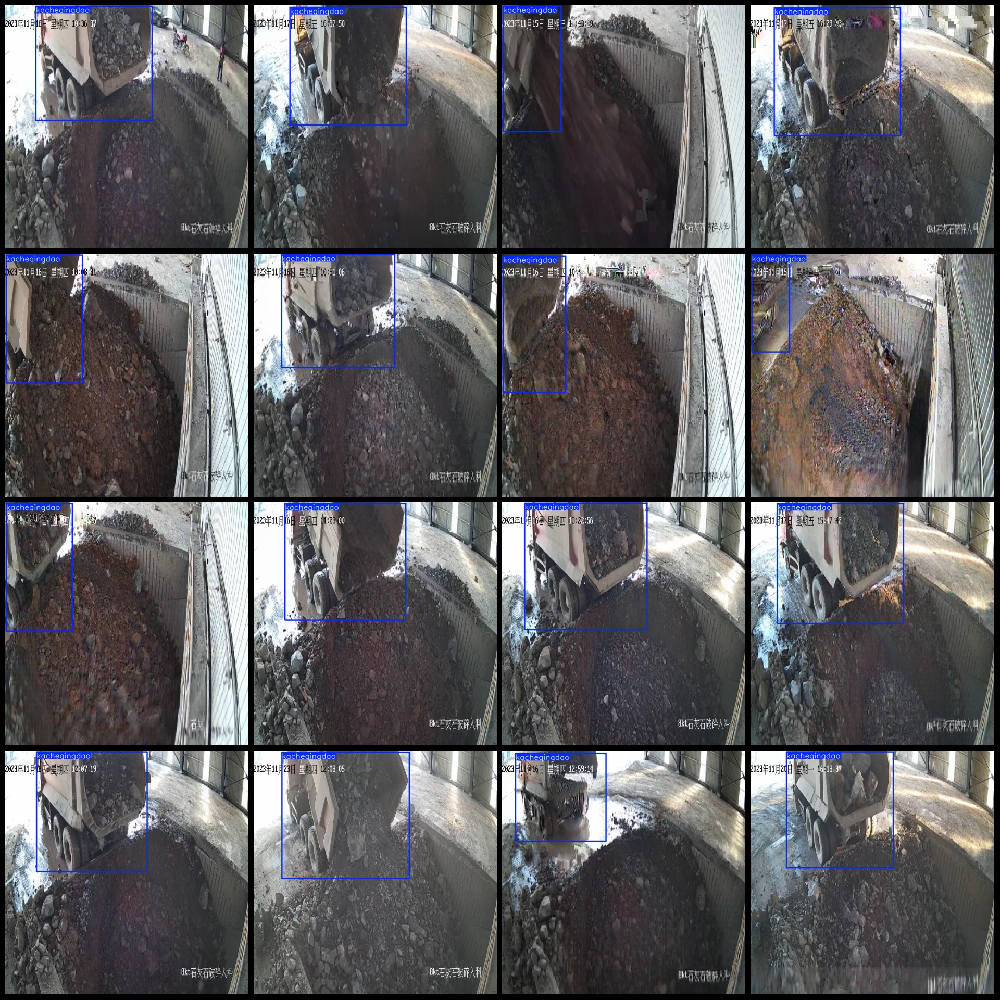

# Smart Industrial Limestone Crusher Truck Overturning Stone Detection Dataset VOC+YOLO Format with 2392 Images in 2 Categories

Please note that the dataset mainly focuses on detecting trucks unloading stones, where bulldozers are only included in two frames. The images are captured from a fixed angle by the camera, and they 
show different time periods during the detection of trucks overturning. Therefore, the images appear relatively monotonous; the top-left corner displays different time periods, indicating not 
repeated images. Please refer to the image preview for details.
The data format is Pascal VOC plus YOLO (excluding the split path in txt files, just containing jpg images along with corresponding VOC xml files and yolo txt files).
Number of images (jpg file count): 2392
Number of annotations (xml file count): 2392
Number of annotations (txt file count): 2392
Number of categories: 2
Categories labeled in XML files: ["kacheqingdao", "tuituche"]
Number of bounding boxes per category:
kacheqingdao (truck overturning) = 2390
tuituche (bulldozer) = 2
Total bounding boxes: 2392
Number of images per category:
kacheqingdao = 2390
tuituche = 2
Image resolution: 640x640
Annotation tool used: labelImg
Annotation rules: draw bounding boxes for each category
Important Notice: The dataset does not have been divided into training, validation, or test sets; you need to do so yourself.
Special Note: This dataset does not guarantee any accuracy in the trained models or weight files.
Image Preview:
Annotation example:

## Images

Here is a pay link on Stripe ( https://buy.stripe.com/3cs8yP7sY87d0vu9AB ). Please contact me lonlonago@foxmail.com after funding $89, and I will send you a complete data files , thank you!

